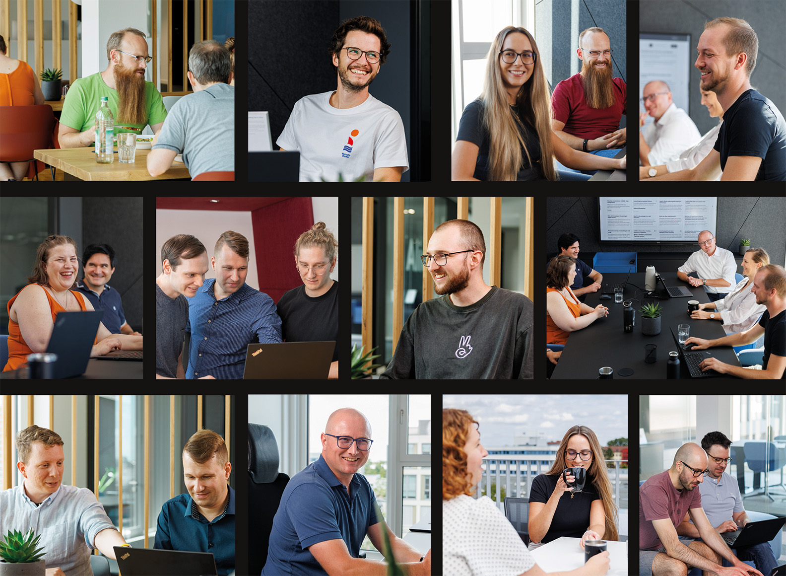
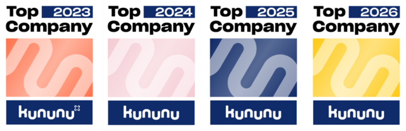

  <a href="https://makandra.de/">
    <picture>
      <source media="(prefers-color-scheme: light)" srcset="media/makandra.light.svg">
      <source media="(prefers-color-scheme: dark)" srcset="media/makandra.dark.svg">
      
    </picture>
  </a>
   
  &nbsp;

# Welcome to makandra

We are [makandra](https://makandra.de/), a team of developers, Linux administrators and cloud specialists in Augsburg, Germany.
When software can’t afford to fail and the stakes are high: we develop web applications and AI solutions for business-critical processes.

# Strong with open source technologies

We are an active part of the open source community and the creators of [makandra cards](https://makandra.de/en/articles/makandra-cards-tech-knowledgebase-331)
Take a look at our repositories on GitHub.

# Join our Team

Are you looking for a new challenge and value structured work and genuine team spirit? Then [join makandra](https://makandra.de/en/career-5).

